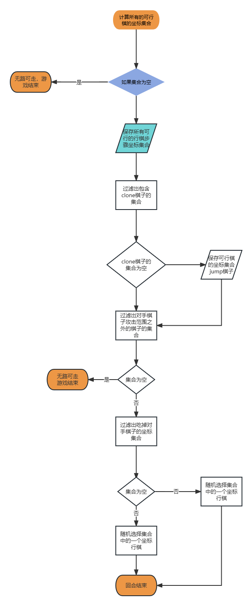

# 项目说明

## 1、运行环境

jdk17，使用最新的idea或者eclipse等编辑器打开项目，由于然后引入library目录下的junit-4.12.jar以及hamcrest-core-1.3.jar(junit需要依赖此jar包不然无法运行)。

然后运行`Main.java`文件。

## 2、AI Player

### 1、AI算法设计思路说明：

1.  因为赢棋的关键在于，“吃掉”对手的棋子或者让对手无路可走（也就是让己方棋子铺满棋盘），所以在所的行棋步骤中，尽可能选择多的clone棋子，将对手逼近绝地。
2.  但是，光将对手逼近绝地没用，我们更关键的步骤是吃掉对手棋子同时不能被对手吃掉，所以在行棋的路径上，我们要避开对手棋的最大行棋范围，简单说就是避开对手的攻击范围，将对手的落单棋子逐个消灭。

### 2、AI算法实现：

算法流程图如下

[在线编辑的地址](https://www.processon.com/v/6460774723e6913530439960)登录后即可编辑

